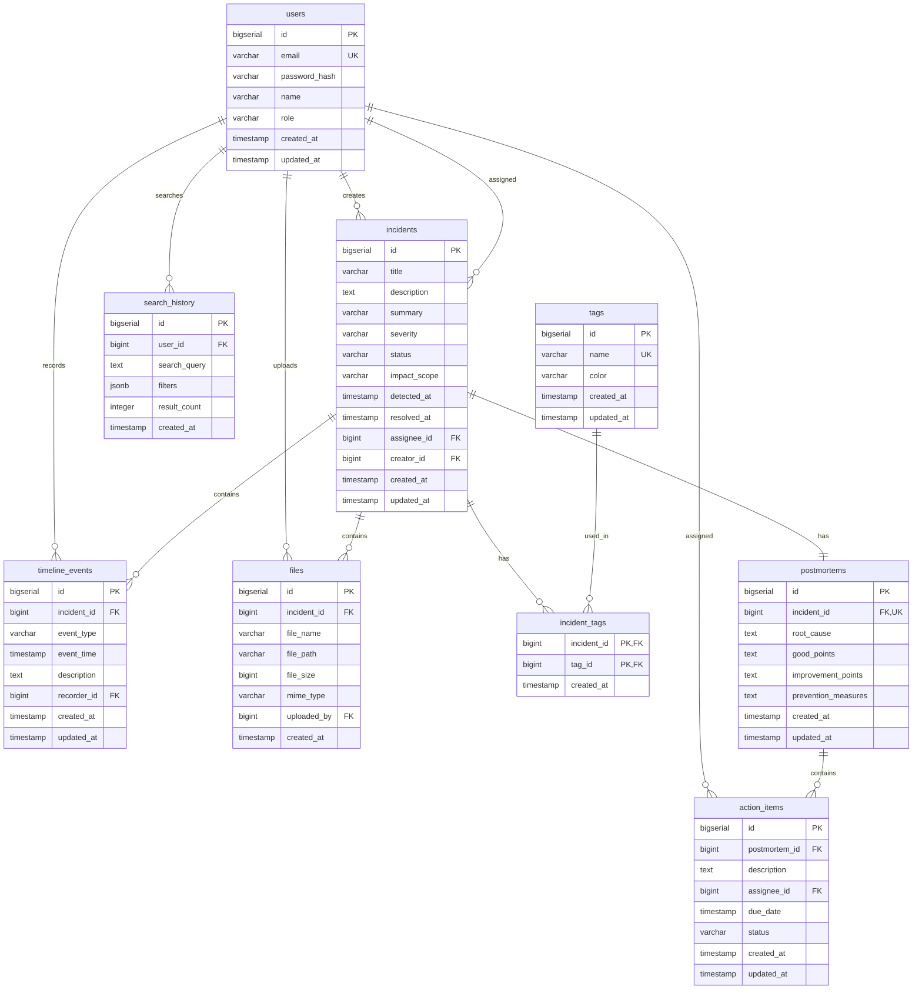

# incidex ER図

## 1. エンティティ関係図

---

## 2. エンティティ詳細

### 2.1 users（ユーザー）
- **説明**: システム利用者
- **主キー**: `id`
- **ユニーク制約**: `email`
- **関連**:
  - インシデント作成者（`incidents.creator_id`）
  - インシデント担当者（`incidents.assignee_id`）
  - タイムライン記録者（`timeline_events.recorder_id`）
  - アクションアイテム担当者（`action_items.assignee_id`）
  - ファイルアップロード者（`files.uploaded_by`）
  - 検索履歴（`search_history.user_id`）

### 2.2 incidents（インシデント）
- **説明**: インシデント情報
- **主キー**: `id`
- **関連**:
  - 作成者（`creator_id` → `users.id`）
  - 担当者（`assignee_id` → `users.id`）
  - タグ（`incident_tags` 経由）
  - タイムラインイベント（`timeline_events.incident_id`）
  - ポストモーテム（`postmortems.incident_id`、1対1）
  - ファイル（`files.incident_id`）

### 2.3 tags（タグ）
- **説明**: インシデント分類用タグ
- **主キー**: `id`
- **ユニーク制約**: `name`
- **関連**:
  - インシデント（`incident_tags` 経由、多対多）

### 2.4 incident_tags（インシデント-タグ関連）
- **説明**: インシデントとタグの多対多関係
- **主キー**: `(incident_id, tag_id)`
- **関連**:
  - インシデント（`incident_id` → `incidents.id`）
  - タグ（`tag_id` → `tags.id`）

### 2.5 timeline_events（タイムラインイベント）
- **説明**: インシデントの時系列イベント
- **主キー**: `id`
- **関連**:
  - インシデント（`incident_id` → `incidents.id`）
  - 記録者（`recorder_id` → `users.id`）

### 2.6 postmortems（ポストモーテム）
- **説明**: インシデントの事後分析
- **主キー**: `id`
- **ユニーク制約**: `incident_id`（1インシデントに1ポストモーテム）
- **関連**:
  - インシデント（`incident_id` → `incidents.id`、1対1）
  - アクションアイテム（`action_items.postmortem_id`）

### 2.7 action_items（アクションアイテム）
- **説明**: ポストモーテムのアクションアイテム
- **主キー**: `id`
- **関連**:
  - ポストモーテム（`postmortem_id` → `postmortems.id`）
  - 担当者（`assignee_id` → `users.id`）

### 2.8 files（ファイル）
- **説明**: インシデントに添付されたファイル
- **主キー**: `id`
- **関連**:
  - インシデント（`incident_id` → `incidents.id`）
  - アップロード者（`uploaded_by` → `users.id`）

### 2.9 search_history（検索履歴）
- **説明**: ユーザーの検索履歴（Phase 2、オプション）
- **主キー**: `id`
- **関連**:
  - ユーザー（`user_id` → `users.id`）

---

## 3. リレーションシップ詳細

### 3.1 1対多（1:N）

| 親エンティティ | 子エンティティ | 外部キー | 削除動作 |
|--------------|--------------|---------|---------|
| users | incidents (creator) | `creator_id` | RESTRICT |
| users | incidents (assignee) | `assignee_id` | SET NULL |
| users | timeline_events | `recorder_id` | RESTRICT |
| users | action_items | `assignee_id` | SET NULL |
| users | files | `uploaded_by` | RESTRICT |
| users | search_history | `user_id` | CASCADE |
| incidents | timeline_events | `incident_id` | CASCADE |
| incidents | files | `incident_id` | CASCADE |
| postmortems | action_items | `postmortem_id` | CASCADE |

### 3.2 1対1（1:1）

| エンティティ1 | エンティティ2 | 外部キー | 説明 |
|-------------|-------------|---------|------|
| incidents | postmortems | `incident_id` | 1インシデントに1ポストモーテム |

### 3.3 多対多（N:M）

| エンティティ1 | 中間テーブル | エンティティ2 | 説明 |
|-------------|------------|-------------|------|
| incidents | incident_tags | tags | 1インシデントに複数タグ、1タグは複数インシデントに使用可能 |

---

## 4. カーディナリティ

### 4.1 各リレーションシップのカーディナリティ

- **users → incidents (creator)**: 1対多（1ユーザーが複数インシデントを作成可能）
- **users → incidents (assignee)**: 1対多（1ユーザーが複数インシデントを担当可能）
- **incidents → tags**: 多対多（1インシデントに複数タグ、1タグは複数インシデントに使用）
- **incidents → timeline_events**: 1対多（1インシデントに複数タイムラインイベント）
- **incidents → postmortems**: 1対1（1インシデントに1ポストモーテム）
- **postmortems → action_items**: 1対多（1ポストモーテムに複数アクションアイテム）
- **incidents → files**: 1対多（1インシデントに複数ファイル）

---

## 5. ビジネスルール

### 5.1 データ整合性ルール

1. **インシデント**:
   - `resolved_at` は `detected_at` 以降であること
   - `status` が 'resolved' または 'closed' の場合、`resolved_at` が設定されていること

2. **ポストモーテム**:
   - `incident.status` が 'resolved' または 'closed' の場合のみ作成可能

3. **ファイル**:
   - 1ファイルのサイズは50MB以下
   - 1インシデントあたりの合計ファイルサイズは500MB以下

4. **タイムラインイベント**:
   - `event_time` は `incident.detected_at` 以降であること

5. **アクションアイテム**:
   - `due_date` は `created_at` 以降であること

---

## 6. インデックス戦略

### 6.1 主キーインデックス
すべてのテーブルの `id` カラムに自動的に主キーインデックスが作成される。

### 6.2 外部キーインデックス
すべての外部キーカラムにインデックスを作成（参照整合性チェックの高速化）。

### 6.3 検索用インデックス
- `incidents`: `severity`, `status`, `detected_at`, `resolved_at`, `created_at`
- `timeline_events`: `event_time`
- `action_items`: `status`, `due_date`
- `files`: `incident_id`

### 6.4 全文検索インデックス（Phase 2）
- `incidents`: GINインデックス（`title`, `description`, `summary`）

---

## 7. パフォーマンス考慮事項

### 7.1 クエリ最適化
- インシデント一覧取得時は `incident_summary_view` を使用
- ページネーションは `LIMIT` と `OFFSET` を使用
- 統計情報はRedisにキャッシュ（5分間）

### 7.2 パーティショニング検討
- `incidents` テーブルが10万件を超える場合は、`created_at` によるパーティショニングを検討
- `timeline_events` テーブルが50万件を超える場合は、`incident_id` によるパーティショニングを検討

### 7.3 アーカイブ戦略
- クローズ済みインシデント（`status = 'closed'`）は、一定期間後にアーカイブテーブルに移動することを検討
- アーカイブ期間: 2年（要件に基づく）

